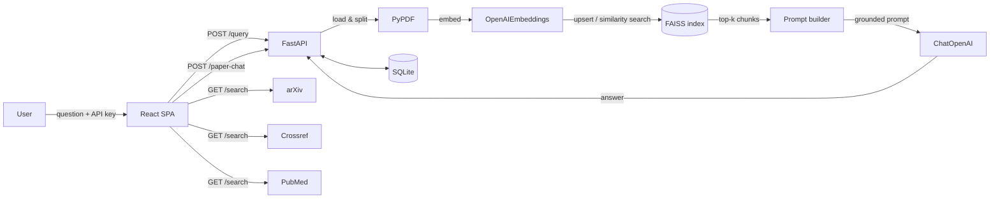

<div align="center">


# LiteraAI

**Research assistant that lets you talk to PDFs and 240M+ academic papers — grounded answers powered by RAG, FAISS and OpenAI.**


<br>


</div>

---

## 1. Problem

Researchers, students, and engineers drown in PDFs and papers. Reading a 30-page document to find one answer is slow, and generic chatbots hallucinate because they have no access to the actual document. Existing academic search engines return lists of links — not understanding — and none of them let you *ask questions* about what they find.

## 2. Solution

LiteraAI is a full-stack web app where every answer is grounded in real source material:

- **Chat with any PDF** — upload a document and ask questions; answers are generated from the paper's actual content via retrieval-augmented generation (RAG) with FAISS vector search.
- **Search four research sources at once** — arXiv, Semantic Scholar (Crossref), PubMed, or Hybrid mode querying all of them in parallel.
- **Talk about any search result** — each paper card has an inline "Talk about it" chat that answers questions using the paper's metadata and abstract.
- **Persistent history** — conversations are stored in SQLite and can be resumed.
- **Bring your own key** — the OpenAI API key lives in the user's browser localStorage and is sent per-request; nothing is stored server-side.

## 3. Architecture

- **Backend (`backend/main.py`)** — FastAPI app exposing `/query`, `/search`, `/paper-chat` and conversation CRUD. Also serves the built frontend from `frontend/dist`, so a single process deploys the whole app.
- **Services (`backend/services/`)** — `vector_service.py` (OpenAI embeddings + FAISS index create/load), `llm_service.py` (ChatOpenAI response generation), `load_service.py` (PyPDF loading + text splitting), `rag_service.py` (prompt building), `db_service.py` (SQLite persistence), plus one service each for arXiv / Crossref / PubMed APIs.
- **Frontend (`frontend/`)** — React 18 + Vite single-page app with Framer Motion animations, hash-based routing, and a settings store synced to localStorage.
- **Storage** — uploaded PDFs land in `backend/uploads/`; each gets a namespaced FAISS index (`<pdf>_vs_openai_<model>`); chat history goes to `backend/db/rag_app.db`.

## 4. Workflow diagram



## 5. Tech stack

<div align="center">

</div>

| Layer | Technology | Why |
|---|---|---|
|  **Backend** | Python 3.11+, FastAPI, Uvicorn | Async endpoints, automatic OpenAPI docs |
|  **AI** | LangChain, OpenAI (`gpt-4o` default, `text-embedding-3-small`) | One provider for chat + embeddings keeps behavior predictable |
|  **Vector store** | FAISS (`faiss-cpu`) | Fast local similarity search, zero infra |
|  **Search APIs** | arXiv Atom API, Crossref, NCBI E-utilities | Free, keyless scholarly metadata |
|  **Database** | SQLite via `db_service.py` | Zero-config persistence of conversations |
|  **Frontend** | React 18, Vite 6, Framer Motion | Fast builds, animated UI without a component library |
|  **Styling** | Hand-written CSS design system | Custom brand palette, no framework bloat |

## 6. Key engineering decisions

- **Single-provider (OpenAI-only) LLM/embedding layer** — earlier multi-provider support (Gemini/Ollama) caused routing failures and mismatched embedding dimensions; hardcoding OpenAI made model config explicit and reproducible.
- **Per-request credentials instead of server-side keys** — the browser stores the user's API key and sends it with each request, so one deployment serves many users without shared secrets.
- **Namespaced FAISS indices per embedding config** (`embedding_tag()`) — switching embedding models doesn't corrupt existing indexes; old ones simply become orphaned.
- **Serving the built SPA from FastAPI** — one process, one port, one deploy target; no CORS setup needed.
- **Parallel source fan-out with per-source error isolation** — a Crossref outage degrades results instead of failing the whole hybrid search.


## 7. Installation

1. **Prerequisites:** Python 3.11+, Node.js 18+.
2. **Clone:** `git clone https://github.com/Dev-with-Mouzan/Litera_Ai.git && cd Litera_Ai`
3. **Backend deps:**
   ```bash
   pip install -r backend/requirements.txt
   ```
4. **Environment (optional):** create `backend/.env` to set fallbacks:
   ```env
   OPENAI_API_KEY=sk-...
   OPENAI_MODEL=gpt-4o
   OPENAI_EMBEDDING_MODEL=text-embedding-3-small
   ```
   The app works without `.env` if you paste your key into Settings in the UI.
5. **Run backend:** `python -m uvicorn backend.main:app --reload` → http://localhost:8000
6. **Production frontend build:**
   ```bash
   cd frontend && npm install && npm run build
   ```
   The FastAPI server automatically serves `frontend/dist`.

## 8. API documentation

Interactive Swagger UI is available at `/docs`. Main endpoints:

| Method | Path | Purpose |
|---|---|---|
| POST | `/query` | Upload a PDF or query an indexed one (multipart form: `query`, `file`/`pdf_name`, optional `model`, `api_key`) → `{response}` |
| GET | `/search?q=&source=` | Search `arxiv` \| `semantic` \| `pubmed` \| `hybrid` → `{results: [{title, authors, abstract, url, year, source}]}` |
| POST | `/paper-chat` | JSON `{paper, query, messages[]}` → grounded Q&A about one paper |
| GET | `/api/conversations` | List saved conversations |
| DELETE | `/api/conversations/{id}` | Delete a conversation |
| GET | `/{path}` | Serves the built SPA (catch-all) |

## 9. Evaluation/results

No formal benchmark suite yet. Manual verification performed during development:

| Check | Result |
|---|---|
| arXiv parse (real titles/authors/dates returned) | Pass — 5/5 fields populated |
| Semantic Scholar (Crossref) search | Pass after fixing invalid `select` field |
| PubMed esearch + esummary + efetch pipeline | Pass — abstracts retrieved |
| Hybrid fan-out | Pass — 15 results (5 × 3 sources) |
| Invalid API key handling | Pass — clean 401 surfaced as toast, no crash |

Intended methodology: golden-question set per source with expected-paper assertions, plus RAG faithfulness scoring against source abstracts.

## 10. Limitations

- **Needs a persistent filesystem** — FAISS indexes and SQLite live on local disk, so serverless platforms (Vercel/Netlify functions) and ephemeral containers lose data on redeploy.
- **Abstract-only grounding for searched papers** — "Talk about it" uses title/authors/abstract, not full text (paywalled PDFs aren't fetched).
- **Single-user concurrency** — SQLite and per-request FAISS loading are fine for personal/small-team use, not high traffic.
- **No authentication** — anyone with the URL can use the deployment (and burn its server-side key, if set).
- **Embedding model changes orphan old indexes** — previous PDFs re-index on first query under a new tag.

---

<div align="center">
<br>
<i>LiteraAI — every answer grounded in a real source.</i>
</div>
